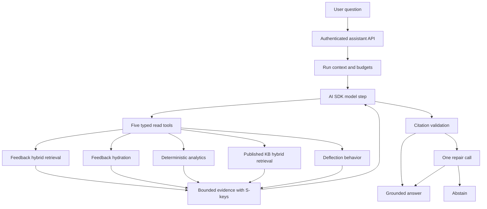

# Agentic RAG Learning And Roadmap

Status: foundation implemented  
Product: Triage  
Stack: NestJS, AI SDK, OpenRouter, PostgreSQL, pgvector, Prisma, BullMQ

## Goal

Build a measurable, production-oriented agentic RAG assistant while making each layer
understandable to a first-time implementer.

The first boundary is deliberately read-only. Approved write workflows belong in a
later persisted orchestration layer with authorization, idempotency, audit logs, and
human confirmation.

## Implemented Foundation

The current foundation includes:

- five typed, capability-oriented tools;
- native AI SDK multi-step tool calling;
- application-controlled workspace and actor context;
- hybrid feedback and published-KB retrieval;
- generated PostgreSQL full-text indexes and pgvector search;
- RRF rank fusion with lexical fallback;
- BullMQ feedback indexing and idempotent backfill;
- deterministic feedback analytics;
- source, character, step, execution, and time budgets;
- duplicate-call prevention and partial-failure tolerance;
- run-scoped citations, one repair attempt, and abstention;
- structured traces and explicit stop reasons;
- 32 evaluation cases and retrieval-mode comparison;
- backend regression tests.

## Architecture



## Learning Path

### 1. Typed tools

Read:

- `apps/backend/src/assistant/assistant-tool-schemas.ts`
- `apps/backend/src/assistant/assistant-tool-registry.ts`

Learn the division of responsibility:

- the model chooses from declared tools;
- Zod validates model-produced arguments;
- closures inject trusted workspace context;
- application services execute the operation;
- the model receives projected, bounded results.

Exercise: add a harmless optional filter and trace it from schema to SQL and test.

### 2. Agent loop

Read:

- `apps/backend/src/assistant/local-assistant.orchestrator.ts`
- `apps/backend/src/ai/ai.service.ts`

Learn what a model step is, how tool results become the next step's context, and why
both step and execution limits are needed.

Exercise: follow one coverage question that calls `searchFeedback` and then
`searchKnowledge`.

### 3. Retrieval

Read:

- `apps/backend/src/retrieval/hybrid-retrieval.service.ts`
- `apps/backend/src/retrieval/feedback-index.service.ts`
- the agentic RAG migration.

Learn:

- lexical search favors exact terms;
- embeddings favor semantic similarity;
- RRF combines ranks rather than incompatible scores;
- tenant and publication filters must run before ranking;
- lexical fallback preserves availability.

Exercise: create a retrieval fixture where lexical and vector modes find different
relevant records, then measure fused recall.

### 4. Grounding

Read the citation path in the registry and orchestrator.

Learn the distinction between:

- retrieved data;
- accepted evidence;
- a citation key;
- a claim that is semantically supported.

Exercise: make the draft cite `[S99]` and observe repair and abstention.

### 5. Evaluation

Read:

- `apps/backend/src/assistant/evals/assistant-eval-cases.ts`
- `apps/backend/src/assistant/evals/deterministic-evaluator.ts`
- `apps/backend/src/assistant/evals/retrieval-comparison.ts`

Learn why deterministic gates own safety and contract checks, while an LLM judge is
limited to correctness and grounding assessments.

Exercise: add a domain-specific case based on a real support question before changing
the prompt or retrieval configuration.

## Next Milestones

### M1: Run the corpus against seeded data

- Add relevance judgments with concrete feedback/chunk IDs.
- Execute lexical, vector, and fused modes against the same snapshot.
- Store recall, latency, tool selection, and abstention results as CI artifacts.
- Add the optional live-model correctness and grounding judge.

Exit condition: retrieval and answer changes have a repeatable regression report.

### M2: Retrieval quality improvements

- Tune full-text dictionaries and field weighting.
- Add query rewriting only when first retrieval is weak.
- Evaluate a reranker against the existing RRF baseline.
- Add evidence-quality thresholds based on measured data.

Exit condition: an improvement must beat the baseline evaluation, not just sound more
advanced.

### M3: Observability

- Export traces to the project's telemetry backend.
- Track tool latency, embedding fallback rate, stop reasons, and citation-repair rate.
- Add dashboards and alerts without storing raw sensitive prompts by default.

Exit condition: production failures can be diagnosed from structured telemetry.

### M4: Persisted approved workflows

Use LangGraph or an equivalent durable workflow layer when Triage adds actions such as:

- draft a Linear or Jira issue;
- request human approval;
- resume after approval;
- execute idempotently;
- record the action in an audit log.

Exit condition: workflows survive process restarts and cannot execute writes without
the required approval.

## Industry Basis

The design follows these documented patterns:

- typed, clearly described tools with high-signal outputs;
- agents selecting flexible retrieval capabilities;
- retrieve, inspect, rewrite, and retry loops;
- hybrid lexical and semantic retrieval;
- reciprocal-rank fusion;
- deterministic evaluation gates plus optional semantic judging.

Project-specific evidence still comes from Triage's evaluation corpus. Industry
patterns justify the architecture; they do not prove that a retrieval configuration is
better for this product.

## Operating Commands

```bash
pnpm db:migrate:deploy
pnpm index:feedback
pnpm exec tsc -p apps/backend/tsconfig.app.json --noEmit
pnpm nx test backend --runInBand
```
