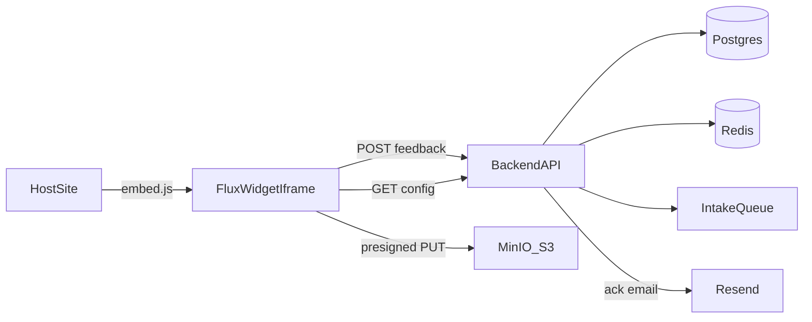

# Widget MVP Implementation Plan

A phased, opinionated roadmap for bringing the Triage feedback widget from its current MVP to production-grade parity with industry-standard products (Intercom, Zendesk, Sentry User Feedback, Canny, Userback, etc.).

**Audience:** Engineers implementing this in the Triage monorepo.  
**Scope:** MVP — see [Deferred (post-MVP)](#deferred-post-mvp) for features intentionally excluded from this plan.

---

## Overview

### Current state

The widget MVP now has the core platform pieces in place:

- **Multi-widget model** - `Workspace`, `Widget`, `WidgetTheme`, widget keys, widget secrets, and `Feedback.widgetId` are in the Prisma schema.
- **Public API** - `GET /api/v1/widget/config/:widgetKey`, `POST /api/v1/widget/feedback`, `POST /api/v1/widget/upload-url`, and `POST /api/v1/widget/survey` live in `apps/backend/src/widget/`.
- **Admin API** - authenticated widget CRUD, duplicate, archive, and secret rotation live under `apps/backend/src/widget-admin/`.
- **Embed script** - `/embed.js` aliases the versioned `/embed/v1` route, with an immutable hash route for long-lived installs.
- **Submit flow** - configured form fields, consent, image attachments, user metadata, short ticket references, security checks, and AI triage feed the internal dashboard.

Key gaps vs industry standard: captcha, encrypted secret storage, email acknowledgements, read-only status links, deeper observability, full compliance automation, localization, and some accessibility polish remain post-MVP work.

### MVP goal

Ship a production-safe widget with:

- Multiple widgets per workspace
- Security (origin allowlist, HMAC, rate limits, captcha, PII redaction)
- **Image attachments only** (no screenshot capture or annotation)
- Configurable forms (types, ratings, custom fields)
- AI deflection / KB search before submit
- Email acknowledgement + read-only status page (no threaded replies or realtime)
- Targeting, triggers, branding, accessibility
- Observability and compliance basics
- **`embed.js` only** — no published npm SDKs

### Architecture



---

## Deferred (post-MVP)

These features were in the full roadmap but are **explicitly out of MVP scope**. Do not implement them until after MVP ships.

| Feature | Rationale |
|---|---|
| **Screenshot capture** (html2canvas / html-to-image) | Advanced; image upload covers most bug-report needs for MVP |
| **Screenshot annotation** (Konva / Fabric.js) | Depends on screenshot capture; high UX complexity |
| **Session replay** (rrweb) | Heavy payload, consent complexity, separate product surface |
| **Threaded replies** (end-user ↔ agent conversation in widget) | Requires new messaging model, moderation, notifications |
| **Realtime updates** (socket.io in widget iframe) | Depends on threading; async email + status page is enough for MVP |
| **Published framework SDKs** (`@triage/widget-react`, Vue, Angular, mobile) | Company can vendor internal helpers from repo; no npm publish for MVP |
| **PDF / video / recording attachments** | Image-only for MVP |
| **Live agent chat** | Different product category; async ack is sufficient |

---

## Phase 0 — Multi-widget foundation

**Effort:** 3–5 dev days  
**Priority:** Ship-blocking — everything else depends on this.

### Goal

Replace the singleton `WidgetConfig` with a proper multi-widget model so each workspace can have multiple widgets (marketing site, in-app, per-brand, etc.) with separate keys, branding, and analytics.

### Schema (`libs/db/prisma/schema.prisma`)

1. **New `Workspace` model** — even if you only seed one row today:
   - `id String @id @default(cuid())`
   - `slug String @unique`
   - Move fields from `WorkspaceConfig` here (or keep `WorkspaceConfig` as 1:1 extension)

2. **New `Widget` model** (replaces singleton `WidgetConfig`):
   - `id`, `workspaceId`, `name`, `widgetKey @unique @default(cuid())`
   - `widgetSecret String @default(cuid())` — for HMAC (Phase 1)
   - `archivedAt DateTime?`
   - Existing branding fields: `brandColor`, `accentColor`, `position`, `size`, `title`, `description`, `successMessage`, `enabledUserFields`, `requiredUserFields`, `enabledMetadataKeys`
   - Unique index on `(workspaceId, name)`

3. **`Feedback.widgetId String?`** — nullable initially for migration; backfill to a `legacy` widget, then make `NOT NULL` in a follow-up migration.

4. **Optional `WidgetTheme` (1:1)** — defer detailed fields to Phase 7; add the FK now if you want a clean split later.

### Migration strategy

Use **two migrations**, not one:

1. **Additive** — new tables + nullable `Feedback.widgetId`; deploy code that writes to both old singleton and new `Widget` row.
2. **Destructive** — drop `WidgetConfig` singleton usage; make `widgetId NOT NULL`.

This avoids a stop-the-world deploy.

### Backend

| File | Action |
|---|---|
| `apps/backend/src/widget-admin/widget-admin.module.ts` | **Create** — Nest module |
| `apps/backend/src/widget-admin/widget-admin.controller.ts` | **Create** — `GET/POST /widgets`, `GET/PATCH/DELETE /widgets/:id`, `POST /widgets/:id/rotate-secret`, `POST /widgets/:id/duplicate` |
| `apps/backend/src/widget-admin/widget-admin.service.ts` | **Create** — CRUD logic |
| `apps/backend/src/widget/widget.service.ts` | **Update** — resolve widget by `widgetKey` from `Widget` table |
| `apps/backend/src/settings/settings.service.ts` | **Update** — rename `getWidget()` → `getDefaultWidget()` for seed path only |
| `apps/backend/src/feedback/feedback.service.ts` | **Update** — accept and persist `widgetId` on `createWidgetTicket()` |
| `apps/backend/src/app/app.module.ts` | **Update** — register `WidgetAdminModule` |

Guard all widget-admin routes with `SessionGuard` + `@Roles('admin')`.

### Frontend

| File | Action |
|---|---|
| `apps/flux/src/app/dashboard/widgets/page.tsx` | **Create** — list widgets, create / duplicate / archive |
| `apps/flux/src/app/dashboard/widgets/[id]/page.tsx` | **Create** — widget editor (move "Widget" section out of settings) |
| `apps/flux/src/app/dashboard/settings/page.tsx` | **Update** — remove widget section; link to `/dashboard/widgets` |
| `apps/flux/src/app/dashboard/dashboard-nav.tsx` | **Update** — add "Widgets" nav item |
| `libs/api-client/src/index.ts` | **Update** — add widget CRUD client methods |

The iframe layer (`apps/flux/src/app/widget/page.tsx`) already takes `?widgetKey=…` — no change needed there.

### Opinionated picks

- Prisma split migrations as described
- Seed one `Workspace` with `slug = 'default'` and one `Widget` named "Default"
- No third-party libs for this phase

### Acceptance criteria

- [ ] Two widgets exist with different `brandColor`; embedding each on a test page renders the correct branding
- [ ] Submitting via widget A creates a `Feedback` row with `widgetId = A`
- [ ] Singleton `WidgetConfig.id = 'default'` is removed after migration 2
- [ ] `pnpm db:migrate` succeeds on a fresh database

---

## Phase 1 — Security and abuse prevention

**Effort:** 5–7 dev days  
**Priority:** Ship-blocking — do not expose widget to real customers without this.

### Goal

Harden the public widget surface against abuse, spoofing, and data leakage.

### 1a. Per-widget allowed origins

**Schema:** `Widget.allowedOrigins String[] @default([])` — e.g. `["https://acme.com", "https://*.acme.com"]`

**Backend:**

- Create `apps/backend/src/widget/origin.guard.ts` — Nest guard on `POST /widget/feedback` and `GET /widget/config/:widgetKey`
- Read `Origin` / `Referer`, look up widget by key, reject 403 if not in allowlist
- Wildcard matching via `minimatch`
- **Opinionated:** allow `localhost` / `127.0.0.1` only when `Widget.devMode === true`

**Frontend:**

- Multi-input chip control in widget editor for origins
- "Test origin" button that validates current browser origin against saved rules

### 1b. HMAC user verification

**Schema:** `Widget.identityVerificationRequired Boolean @default(false)`

**Shared types (`libs/shared-types/src/index.ts`):**

- Extend `widgetFeedbackBodySchema` with optional `userHash: z.string().optional()`

**Backend:**

- Compute `HMAC-SHA256(widgetSecret, user.email || user.id)` and compare
- If `identityVerificationRequired` and hash missing/mismatch → 401

**Embed / docs:**

- `embed.js` accepts `data-user-hash` attribute
- `TriageWidget.identify(user, metadata, { userHash })` (Phase 8)
- Optional internal helper in `libs/widget-server/sign-user.ts` (repo-only, not published)

### 1c. Per-key, per-IP rate limiting

Replace global `@Throttle` on `WidgetController` with custom `WidgetThrottlerGuard`:

- Key: `widgetKey + clientIp`
- Limits from widget row: `Widget.rateLimitPerMinute Int @default(30)`
- Storage: Redis via `@nestjs/throttler` Redis adapter (already have ioredis)
- Separate limits: `GET /config` ~120/min, `POST /feedback` ~30/min (configurable)

### 1d. Captcha and honeypot

**Schema:**

- `Widget.captchaProvider 'turnstile' | 'hcaptcha' | 'none' @default('none')`
- `Widget.captchaSiteKey String?`
- `Widget.captchaSecret String?` (encrypted — see 1f)

**Backend:** Verify token with Turnstile/hCaptcha siteverify on submit

**Frontend:** `@marsidev/react-turnstile` in `apps/flux/src/app/widget/page.tsx` when configured

**Honeypot (always on):** invisible `<input name="website">`; reject if non-empty

**Opinionated pick:** Cloudflare Turnstile as default (free, invisible mode available)

### 1e. PII redaction and abuse filter

Create `apps/backend/src/widget/sanitize.ts`:

1. Regex redaction: credit-card patterns, JWTs, AWS keys, API tokens (`sk-`, `xoxb-`), configurable email/phone in metadata → `[REDACTED]`
2. Optional profanity via `bad-words` when `Widget.profanityFilter === true`

Apply to `message`, `userContext`, `metadata` text fields — **not** `user.email`.

Write `AuditLog` entry with `action = 'widget_redacted'`.

### 1f. Secret storage

Encrypt `widgetSecret` and `captchaSecret` at rest:

- AES-256-GCM with env-derived key (`WIDGET_KMS_KEY`)
- Wrap via `apps/backend/src/crypto/crypto.service.ts`
- Do not pull in HashiCorp Vault for MVP

### 1g. Iframe and embed hardening

Update `apps/flux/src/app/embed.js/route.ts`:

- `frame.setAttribute('sandbox', 'allow-scripts allow-forms allow-same-origin allow-popups')`
- `frame.referrerPolicy = 'strict-origin-when-cross-origin'`
- `frame.loading = 'lazy'` — load iframe only when panel opens
- Validate `event.source === frame.contentWindow` on `postMessage` handlers

### Acceptance criteria

- [ ] Submit from domain not in allowlist → 403
- [ ] Widget with `identityVerificationRequired = true` rejects invalid/missing `userHash`
- [ ] 31st submission/min from one IP → 429
- [ ] Honeypot filled → rejected; invalid Turnstile token → rejected
- [ ] Message with `4111-1111-1111-1111` stored as `[REDACTED]` with audit row

---

## Phase 2 — Image attachments and autocapture

**Effort:** 4–5 dev days (MVP-trimmed)

### Goal

Let users attach images to feedback and automatically capture useful debugging context — without screenshot capture, annotation, or session replay.

### Included in MVP

#### 2a. Image attachments only

**Schema — `Attachment` model:**

```
id, feedbackId (FK cascade), widgetId, kind: 'image', mimeType, sizeBytes,
storageKey, width Int?, height Int?, createdAt
```

**Per-widget config:**

- `Widget.maxAttachmentBytes Int @default(10_485_760)` (10 MB)
- `Widget.allowedMimeTypes String[] @default(["image/png","image/jpeg","image/webp"])`
- `Widget.maxAttachmentsPerSubmit Int @default(5)`

**Storage:**

- S3-compatible via `@aws-sdk/client-s3`
- Add **MinIO** to `docker-compose.yml` for local dev
- Production: AWS S3, Cloudflare R2, B2, etc.

**Upload pattern (presigned PUT — not through backend):**

1. `POST /widget/upload-url` → `{ url, storageKey, headers }`
2. Browser PUTs directly to object storage
3. On submit, client passes `storageKey[]`; server verifies with `HeadObject`, creates `Attachment` rows

**Frontend:**

- Image picker + thumbnail preview in `apps/flux/src/app/widget/page.tsx`
- Show attachments on ticket detail: `apps/flux/src/app/dashboard/[id]/ticket-detail-view.tsx`

#### 2b. Console and network log autocapture

In `embed.js`, ring-buffer (last 50 console entries, last 30 fetch/xhr with status + URL + duration; no bodies unless opt-in):

- Monkey-patch `console.{log,info,warn,error}`, `window.fetch`, `XMLHttpRequest`
- Hook `window.onerror` and `unhandledrejection`
- On submit: attach to `metadata.consoleLog` and `metadata.networkLog` (cap ~100 KB)
- Redact sensitive headers: `authorization`, `cookie`, `x-api-key`

#### 2c. Browser and device autocapture

Always-on in `metadata.client`:

```js
{
  ua: navigator.userAgent,
  uaData: navigator.userAgentData?.toJSON?.(),
  viewport: { w: innerWidth, h: innerHeight, dpr: devicePixelRatio },
  locale: navigator.language,
  timezone: Intl.DateTimeFormat().resolvedOptions().timeZone,
  colorScheme: matchMedia('(prefers-color-scheme: dark)').matches ? 'dark' : 'light',
  reducedMotion: matchMedia('(prefers-reduced-motion: reduce)').matches,
  network: navigator.connection?.effectiveType,
  url: location.href,
  referrer: document.referrer
}
```

### Excluded from MVP

- Screenshot capture (html2canvas)
- Screenshot annotation (Konva / Fabric)
- Session replay (rrweb)
- PDF, video, recording attachments
- Virus scanning (optional post-MVP; restrict mime types for now)

### Opinionated picks

- MinIO + `@aws-sdk/client-s3`
- Presigned PUT only — never stream uploads through Nest

### Acceptance criteria

- [ ] User attaches two PNGs; both appear on ticket detail page
- [ ] File exceeding `maxAttachmentBytes` shows inline error
- [ ] Submitted bug includes console log with failing fetch in `metadata.networkLog`
- [ ] Invalid mime type (e.g. `.exe`) rejected at upload-url and submit

---

## Phase 3 — Form richness

**Effort:** 5–7 dev days

### Goal

Transform the widget from a single freeform textarea into a configurable form builder.

### 3a. Submission types

**Schema:**

- Enum `WidgetSubmissionType { bug, idea, question, praise, custom }`
- `Widget.enabledTypes WidgetSubmissionType[] @default([bug, idea, question])`

Each type maps to default `category` and escalation hint passed to `EscalationService`. Per-type title/description/icon overrides.

### 3b. Ratings (NPS, CSAT, thumbs)

**Schema:**

- `Widget.surveyMode 'none' | 'csat' | 'nps' | 'thumbs' @default('none')`
- `Survey` model: `id`, `feedbackId?`, `widgetId`, `score`, `scale`, `comment?`, `createdAt`

Render after submit or as standalone via `TriageWidget.openSurvey()` (Phase 8).

### 3c. Configurable form fields

Replace flat `enabledUserFields: string[]` with `WidgetField` model:

| Field | Type |
|---|---|
| `id`, `widgetId`, `key`, `label` | strings |
| `kind` | `text \| textarea \| email \| url \| number \| select \| multiselect \| radio \| checkbox \| rating \| file` |
| `required`, `placeholder`, `helpText` | optional strings |
| `validation` | JSON (regex, min, max) |
| `options` | JSON (select/radio options) |
| `visibleWhen` | JSON (conditional logic) |
| `target` | `user \| metadata \| message \| title \| category \| severity` |
| `order` | Int |

Submit payload: `{ widgetKey, type, fields: Record<string, unknown>, attachments, captchaToken, userHash? }`

Server routes each field to its `target` for backwards compat with `Feedback`.

**Dashboard editor:** drag-to-reorder with `@dnd-kit/core`, live preview pane.

### 3d. Conditional logic

`visibleWhen` predicate: `{ all: [{ field: 'type', op: 'eq', value: 'bug' }] }`

Shared evaluator in `libs/shared-types/src/predicate.ts` — used client-side (hide) and server-side (validate).

### 3e. Severity

First-class `severity 'low' | 'medium' | 'high' | 'critical'` as a preset field; surface on `Feedback` column for reporting.

### 3f. Draft persistence

- `localStorage` keyed by `widgetKey + type`; restore on open; clear on success
- `beforeunload` warning when form is dirty (host page via `postMessage`)

### Opinionated picks

- `@dnd-kit/core` for field reorder
- `react-hook-form` + `@hookform/resolvers/zod`
- Share zod schemas via `libs/shared-types`

### Acceptance criteria

- [ ] Admin builds form with type selector, conditional severity, image upload, CSAT after submit
- [ ] Preview pane reflects unsaved changes
- [ ] Bug with severity=critical escalates via existing rules
- [ ] Reload mid-typing restores draft text

---

## Phase 4 — Submit acknowledgement

**Effort:** 2–3 dev days (MVP-trimmed — no threading or realtime)

### Goal

Close the loop after submit with acknowledgement and status visibility — without building a conversation product.

### Included in MVP

#### 4a. Ticket reference on success

- Add `Feedback.shortId String @unique` — base32 or NanoID alphabet (e.g. `TR-1A2B3C`)
- Show copyable reference on success screen in `apps/flux/src/app/widget/page.tsx`

#### 4b. Email acknowledgement

On widget submit:

- Send "We received your feedback" via **Resend** (already in `package.json`)
- Include ticket reference and magic-link to read-only status page
- Templates: `apps/backend/src/notification/templates/` as React Email (`@react-email/components`)

On agent status change (optional for MVP): email end user with updated status + same magic link.

#### 4c. Read-only status page

- Route: `apps/flux/src/app/widget/status/page.tsx`
- URL: `/widget/status?token=…` (signed JWT via `jose`, 30-day TTL)
- Shows: ticket reference, status, submitted date, original message summary
- **No reply UI, no thread history, no realtime**

#### 4d. Office hours / SLA messaging

**Schema:** `Workspace.officeHours Json?` — `{ tz, schedule: [{ day: 'mon', start: '09:00', end: '18:00' }] }`

Public config returns computed `expectedReplyAt`. Widget renders "We typically reply within 4 hours" or "We're back Monday 9am".

### Excluded from MVP

- Threaded replies (`EndUserMessage`, `POST /widget/threads/:id/reply`)
- End-user "my tickets" conversation view
- Socket.io realtime in widget iframe
- Agent typing indicators

### Opinionated picks

- `resend` + `@react-email/components`
- `jose` for magic-link tokens
- No socket.io in widget for MVP

### Acceptance criteria

- [ ] Submit → confirmation email with ticket reference and status link
- [ ] Status link opens read-only page showing current status
- [ ] Success screen shows copyable `TR-XXXXXX` reference
- [ ] Outside office hours, widget shows "back online" message

---

## Phase 5 — AI deflection and knowledge base

**Effort:** 5–7 dev days

### Goal

Reduce ticket volume by surfacing KB articles and AI answers before the user submits.

### 5a. Knowledge base content

**Schema:**

- `KbArticle`: `id`, `workspaceId`, `slug`, `title`, `body` (Markdown), `published`, `createdAt`, `updatedAt`
- `KbChunk`: `id`, `articleId`, `content`, `embedding Vector(1536)`, `order`
- Enable **pgvector** extension on Postgres

**Authoring UI:** `apps/flux/src/app/dashboard/kb/page.tsx` with `@uiw/react-md-editor`

On save: chunk by H2/H3, embed via OpenRouter, store in `KbChunk`.

### 5b. Inline search-as-you-type

- Debounce 300ms on message field → `POST /widget/kb/search`
- Cosine similarity ANN over `KbChunk`, return top 3
- Render collapsible suggestion cards in widget
- Track impression → click → "didn't help" (Phase 11 events)

### 5c. AI answer ("Ask AI")

- Button streams grounded answer via existing `apps/backend/src/ai/ai.service.ts` + RAG (top-K chunks → prompt)
- Use `ai` SDK `streamText`; force citations in JSON tail
- Always show "Still not solved? Submit anyway"

### 5d. Deflection analytics

- `Deflection` model: search/AI events with outcome `solved | submitted | abandoned`
- Dashboard metric: "127 deflections this week (32% of widget opens)"

### Opinionated picks

- pgvector on existing Postgres — no separate vector DB
- `@uiw/react-md-editor` for KB authoring
- Small/fast model for AI answers; citations required

### Acceptance criteria

- [ ] Typing "reset password" surfaces matching KB article
- [ ] "Ask AI" streams answer with clickable citation
- [ ] "This solved it" closes panel without creating ticket; deflection counter increments

---

## Phase 6 — Targeting and triggers

**Effort:** 4–5 dev days

### Goal

Control when and where the widget appears, and support experimentation.

### 6a. Page targeting

**Schema:** `Widget.pageRules Json?`

```json
{
  "include": [{ "kind": "urlPath", "op": "startsWith", "value": "/checkout" }],
  "exclude": [{ "kind": "urlPath", "op": "contains", "value": "/admin" }]
}
```

Evaluate in `embed.js` on load and `popstate`. If excluded, do not render launcher.

### 6b. Audience rules

**Schema:** `Widget.audienceRules Json?` on identified users:

```json
{ "all": [{ "field": "metadata.plan", "op": "in", "value": ["pro", "enterprise"] }] }
```

Re-evaluate on `TriageWidget.identify()`. Same predicate engine as Phase 3.

### 6c. Triggers

Built-in triggers (all in `embed.js`):

| Trigger | Config |
|---|---|
| `manual` | Default — launcher only |
| `time_on_page` | Seconds before showing launcher |
| `exit_intent` | Mouse leaves viewport top |
| `scroll_depth_percent` | e.g. 50 |
| `dom_ready` | Immediate on load |

Custom CSS trigger: `<button data-triage-open data-triage-type="bug">Report bug</button>`

### 6d. A/B variants

**Schema:** `WidgetVariant` with weights summing to 100.

Assign variant in cookie on first load; sticky across sessions. Send `metadata.widgetVariantId` on submit.

### 6e. Inline embed

`<div data-triage-inline data-widget-key="…">` renders form inline (no floating button, no iframe — same React tree mounted in place).

### Acceptance criteria

- [ ] Widget with `urlPath startsWith /docs` hidden on `/pricing`
- [ ] `time_on_page=15` shows launcher after 15 seconds
- [ ] A/B variant B reaches ~50% and stays sticky on reload
- [ ] Inline embed renders form in host page div

---

## Phase 7 — Branding and theming

**Effort:** 4–6 dev days

### Goal

Full visual customization and localization without code changes per customer.

### 7a. WidgetTheme model (1:1 with Widget)

Fields: `logoUrl?`, `surfaceColor`, `textColor`, `fontFamily`, `borderRadius`, `shadow`, `launcherIcon`, `launcherLabel`, `darkMode 'auto'|'light'|'dark'`, `poweredBy Boolean @default(true)`, `customCss String?` (sanitized via cssnano + allowlist)

### 7b. CSS variable rendering

Replace inline `style={{ background: config.brandColor }}` in widget page with CSS variables on `<html>`, set from public config response. Tailwind tokens reference variables.

Dark mode: respect `prefers-color-scheme` when `darkMode='auto'`.

### 7c. Localization (i18n)

- `Widget.locales String[] @default(["en"])`
- `WidgetCopy` model: `widgetId`, `locale`, `key`, `value`
- `next-intl` in flux; iframe picks locale from `?locale=` (set by `embed.js` from `navigator.language`)
- RTL: `dir="rtl"` driven by locale; use logical Tailwind properties (`ms-`, `me-`)

### 7d. Position and launcher

Positions: `bottom-right`, `bottom-left`, `bottom-center`, `top-right`, `top-left`, `side-tab-right`, `side-tab-left`

`launcherIcon`: Lucide name from allowlist or HTTPS image URL.

Replace hardcoded "Feedback" text in `embed.js` with config-driven label/icon.

### 7e. Live preview

Dashboard editor iframe: `?widgetKey=…&previewToken=…&draft=1`

Backend reads draft config from Redis key for preview token — preview unsaved changes.

### Acceptance criteria

- [ ] `?locale=fr` renders French copy from admin-defined strings
- [ ] Dark host page + `darkMode=auto` shows dark widget
- [ ] Side-tab variant works in LTR and RTL
- [ ] Preview shows unsaved draft before Save

---

## Phase 8 — Embed ergonomics

**Effort:** 3–4 dev days (MVP-trimmed — no published SDKs)

### Goal

Production-grade embed script with a rich JS API — repo-only helpers, no npm publish.

### Included in MVP

#### 8a. Versioned embed.js

- Route: `apps/flux/src/app/embed/v1/route.ts`
- Keep `/embed.js` as alias → latest stable with console deprecation warning
- Build-time content hash: `/embed/v1.[hash].js` with `Cache-Control: public, max-age=31536000, immutable`
- Non-hashed URL: short cache (`max-age=300`)

#### 8b. Async-ready queue (Segment pattern)

```js
window.triageQ = window.triageQ || [];
triageQ.push(['identify', { email: 'user@acme.com' }]);
triageQ.push(['open', { type: 'bug' }]);
// embed.js drains queue when ready
```

#### 8c. Richer window.TriageWidget API

```ts
type TriageWidget = {
  boot(opts: { widgetKey: string; user?: User; userHash?: string; locale?: string }): void;
  shutdown(): void;
  identify(user: User, metadata?: Record<string, unknown>, opts?: { userHash?: string }): void;
  update(metadata: Record<string, unknown>): void;
  open(opts?: { type?: SubmissionType; prefill?: Record<string, unknown> }): void;
  close(): void;
  prefill(values: Record<string, unknown>): void;
  trackEvent(name: string, props?: Record<string, unknown>): void;
  on(event: 'open' | 'close' | 'submit' | 'error', handler: (payload: unknown) => void): () => void;
  setLocale(locale: string): void;
  setMode(mode: 'feedback' | 'survey' | 'status'): void;
  showArticle(slug: string): void;
};
```

Each method → `postMessage` to iframe with dispatcher.

#### 8d. Shadow-DOM launcher

Wrap launcher in shadow root to prevent host CSS bleed. Inline scoped styles in shadow root.

#### 8e. Internal HMAC helper (repo-only)

`libs/widget-server/sign-user.ts`:

```ts
export function signUser(secret: string, identifier: string): string
```

Document in README; **do not publish to npm**.

#### 8f. Programmatic open with prefill

`TriageWidget.open({ type: 'bug', prefill: { title: 'Checkout broken', severity: 'high' } })`

Deep link: `?widgetKey=…&open=bug&prefill[title]=Checkout%20broken`

### Excluded from MVP

- `@triage/widget-react`, Vue, Angular wrappers
- npm publish via changesets
- Mobile SDKs (iOS, Android, RN, Flutter)

### Acceptance criteria

- [ ] `triageQ.push(['open'])` before script load still opens widget once ready
- [ ] Launcher unaffected by host CSS `button { all: unset }`
- [ ] Versioned hash URL serves with immutable cache header
- [ ] `signUser()` in repo produces valid HMAC accepted by backend

---

## Phase 9 — Accessibility and mobile UX

**Effort:** 3–4 dev days

### Goal

WCAG-compliant widget usable on mobile devices.

### 9a. Modal semantics

- `<main>` → `<div role="dialog" aria-modal="true" aria-labelledby="…" aria-describedby="…">`
- Focus trap via `focus-trap-react` while panel open
- On close: return focus to launcher (via `postMessage` to parent)
- Escape → `postMessage({ type: 'triage:close' })`

### 9b. Forms

- `aria-invalid` on validation failures (automatic with react-hook-form + zod)
- `aria-live="polite"` region for submit success/error announcements

### 9c. Reduced motion

Wrap non-essential transitions in `@media (prefers-reduced-motion: reduce)`.

### 9d. Mobile

- Replace fixed `height:min(640px,…)` in embed.js with `100dvh` and `env(safe-area-inset-bottom)`
- Below 640px width: full-screen sheet
- iOS keyboard: `visualViewport` API to resize panel

### 9e. Keyboard shortcut

Default `?` (when not in input) opens widget. Configurable per widget.

### 9f. Automated a11y testing

- axe-core in CI via `@axe-core/playwright`
- Fail build on serious/critical violations

### Acceptance criteria

- [ ] Tab stays inside panel; Escape closes; focus returns to launcher
- [ ] iOS Safari: form visible above keyboard
- [ ] axe reports 0 serious/critical violations

---

## Phase 10 — Compliance

**Effort:** 2–3 dev days

### Goal

Meet baseline privacy and data-handling requirements for B2B customers.

### 10a. Consent gate

- `Widget.requireConsent Boolean @default(false)`
- Checkbox: "I agree to be contacted…" + privacy policy link; submit disabled until checked
- Store on `Feedback.consent Json`: `{ version, acceptedAt, ip, ua }`

### 10b. Cookie-banner integration

- Honor `navigator.globalPrivacyControl`
- Integrate OneTrust / Cookiebot category APIs
- `data-consent-category="functional"` on script tag — don't load until consent granted

### 10c. Data residency (schema only for MVP)

- `Workspace.region 'us' | 'eu'` — wire API base selection later; schema bit now

### 10d. Right to be forgotten

- `DELETE /admin/end-users/:emailHash` — cascade Feedback, Comments, Attachments (S3 objects too)
- Self-serve "delete my data" link in notification emails

### 10e. Retention

- `Workspace.feedbackRetentionDays Int?` (e.g. 365)
- Nightly cron via `@nestjs/schedule` hard-deletes expired rows

### Acceptance criteria

- [ ] Consent required → submit blocked until checked; consent record stored
- [ ] Admin delete request removes DB rows and S3 objects within 24h
- [ ] Retention cron removes 366-day-old test feedback

---

## Phase 11 — Observability and analytics

**Effort:** 3–4 dev days

### Goal

Know how widgets perform and catch failures before customers report them.

### 11a. Widget analytics events

Client batches to `POST /widget/events` every 5s:

| Event | When |
|---|---|
| `widget_loaded` | embed.js init |
| `widget_opened` | panel opened |
| `widget_form_started` | first keystroke |
| `widget_submitted` | successful submit |
| `widget_submission_failed` | validation/API error |
| `kb_searched`, `kb_clicked` | KB interactions |
| `ai_answered` | AI deflection |
| `survey_submitted` | post-submit survey |
| `consent_declined` | user declined consent |

Each event: `widgetId`, `widgetVariantId`, `pageUrl`.

Storage: `WidgetEvent` table + daily roll-up table.

### 11b. Per-widget analytics dashboard

`apps/flux/src/app/dashboard/widgets/[id]/analytics/page.tsx`:

- Funnel: impressions → opens → starts → submits
- Daily spark lines
- Deflection rate (from Phase 5)

### 11c. Config audit log

Extend `AuditLog` for `widget_config_change` with JSON diff on all widget-admin and settings updates.

Surface in `apps/flux/src/app/dashboard/audit/page.tsx`.

### 11d. Embed error monitoring

- Wrap embed.js bootstrap in try/catch → beacon `POST /widget/error` (fire-and-forget)
- Add `@sentry/nestjs` and `@sentry/nextjs` for backend and flux

### 11e. Health checks

Extend `/api/v1/health/ready` to verify S3 bucket reachable and Turnstile key valid when configured.

### Acceptance criteria

- [ ] Widget with 100 impressions / 30 submits shows 30% submit rate on dashboard
- [ ] Embed script throw reports to `/widget/error` and appears in Sentry
- [ ] Config change creates audit log entry with diff

---

## Phase 12 — Quality of life

**Effort:** 2–3 dev days

### Goal

Polish that improves daily use without new product surfaces.

| Feature | Implementation |
|---|---|
| Markdown preview | `react-markdown` + `rehype-sanitize` toggle in textarea |
| Emoji picker | `emoji-picker-react` behind button (not auto-show) |
| Keyboard shortcut help | `?` key cheatsheet inside widget |
| Draft restore toast | "We saved your message" on reopen |
| File type/size hints | From widget config in upload UI |
| "Powered by" toggle | `WidgetTheme.poweredBy`; wire plan flag later |

### Acceptance criteria

- [ ] Markdown preview renders sanitized HTML
- [ ] Emoji inserts at cursor in message field
- [ ] Powered-by badge hidden when `poweredBy=false`

---

## Cross-cutting concerns

Run these alongside every phase — not as a separate phase at the end.

### Two-migration deploy strategy

Every schema change: additive migration first (deployable independently), destructive migration after code is rolled out.

### Feature flags

Add `FeatureFlag` model. Gate new behavior (HMAC enforcement, AI deflection, captcha) for dark launches per workspace.

### Testing requirements (per phase)

| Layer | Tool | Location |
|---|---|---|
| Zod schemas | Jest | `libs/shared-types/src/__tests__/` |
| Nest services/controllers | Jest | `apps/backend/src/<feature>/__tests__/` |
| Widget iframe E2E | Playwright | `apps/flux-e2e/` (new project) |
| Accessibility | axe-core | CI via `@axe-core/playwright` |

Do not ship embed.js changes without Playwright smoke on Chromium, Firefox, WebKit.

### Security review checkpoints

Hold internal threat-model review after:

- Phase 1 (security)
- Phase 2 (uploads + autocapture)
- Phase 4 (magic links + email)
- Phase 10 (compliance)

### Documentation

Per phase, update:

- `README.md` — setup and env vars
- Developer guide on marketing site (`apps/site`) for every public widget API surface

---

## Revised timeline

Assumes one mid-senior engineer driving implementation.

| Quarter | Phases | Focus |
|---|---|---|
| **Q1** | 0, 1, 11 (basic events + audit) | Foundation + security — ship-blocking |
| **Q2** | 2 (images only), 3, 7 | Rich submissions + forms + theming |
| **Q3** | 4 (ack only), 5, 9 | Email ack + AI deflection + accessibility |
| **Q4** | 6, 8 (embed.js only), 10, 12 | Targeting + embed DX + compliance + polish |

**Total MVP effort:** ~7–10 engineer-weeks.

---

## Explicitly deferred summary

For quick reference when scoping sprints:

1. Screenshot capture
2. Screenshot annotation
3. Session replay (rrweb)
4. Threaded end-user replies
5. Realtime widget updates (socket.io)
6. Published npm SDKs (React, Vue, mobile)
7. PDF / video attachments
8. Live agent chat

Revisit these after MVP ships and you have production usage data.
